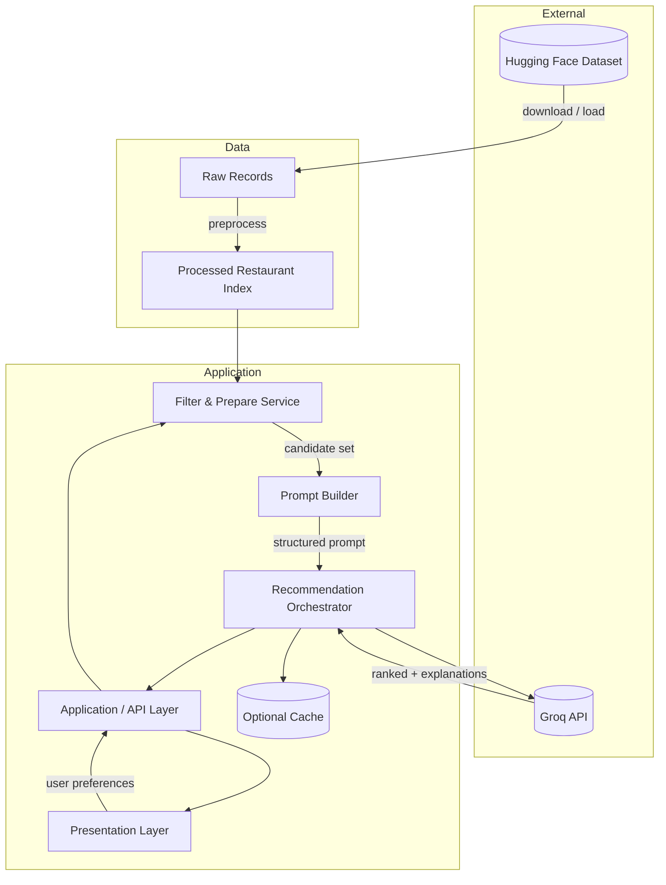
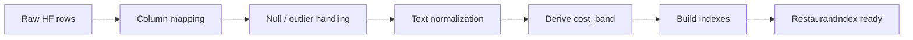
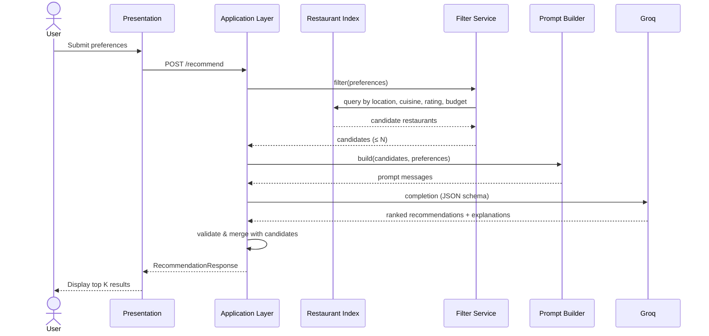
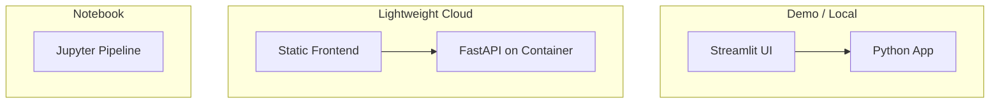

# Architecture: AI-Powered Restaurant Recommendation System

This document describes the technical architecture for the Zomato-inspired restaurant recommendation service. It expands on [context.md](./context.md) and [prblmstatement.txt](./prblmstatement.txt) with component boundaries, data flows, interfaces, and implementation guidance.

---

## Table of Contents

1. [Goals and Non-Goals](#1-goals-and-non-goals)
2. [High-Level Architecture](#2-high-level-architecture)
3. [Component Design](#3-component-design)
4. [Data Architecture](#4-data-architecture)
5. [Request and Response Flow](#5-request-and-response-flow)
6. [LLM Integration](#6-llm-integration)
7. [Filtering and Ranking Strategy](#7-filtering-and-ranking-strategy)
8. [API and Interface Contracts](#8-api-and-interface-contracts)
9. [Presentation Layer](#9-presentation-layer)
10. [Configuration and Secrets](#10-configuration-and-secrets)
11. [Error Handling and Resilience](#11-error-handling-and-resilience)
12. [Performance and Cost](#12-performance-and-cost)
13. [Security and Privacy](#13-security-and-privacy)
14. [Testing Strategy](#14-testing-strategy)
15. [Deployment Options](#15-deployment-options)
16. [Suggested Repository Layout](#16-suggested-repository-layout)
17. [Implementation Phases](#17-implementation-phases)
18. [Requirements Traceability](#18-requirements-traceability)

---

## 1. Goals and Non-Goals

### Goals

| Goal | Description |
|------|-------------|
| **Personalized recommendations** | Combine structured dataset filtering with LLM reasoning to produce ranked, explained suggestions. |
| **Transparent results** | Every recommendation includes structured fields (name, cuisine, rating, cost) plus an AI-generated rationale. |
| **Preference-driven** | Support location, budget tier, cuisine, minimum rating, and free-text additional preferences. |
| **Maintainable pipeline** | Clear separation between data loading, filtering, LLM orchestration, and UI. |
| **Reproducible data** | Single canonical dataset from Hugging Face with versioned preprocessing. |

### Non-Goals (Initial Release)

- User accounts, authentication, or persistent user history
- Real-time Zomato API integration or live availability/booking
- Training a custom recommendation model (hybrid retrieval + LLM is sufficient)
- Multi-city geospatial routing or map-based discovery
- Payment, reservations, or delivery orchestration

---

## 2. High-Level Architecture

The system follows a **layered pipeline architecture**: ingest once (or on schedule), filter on each request, enrich with an LLM, then render results.



### Architectural Principles

1. **Structured-first, LLM-second** — Hard filters (location, min rating, budget band) reduce noise and token cost before the LLM sees data.
2. **Deterministic boundary** — Filtering and field normalization are rule-based; ranking and natural-language explanations are LLM-assisted.
3. **Fail gracefully** — If the LLM is unavailable, return filter-only results with a degraded message.
4. **Prompt as contract** — Input schema to the LLM is JSON or tabular text with fixed fields so outputs can be parsed reliably.

---

## 3. Component Design

### 3.1 Data Ingestion Module

**Responsibility:** Load the Zomato dataset from Hugging Face, validate schema, clean records, and persist a queryable in-memory or file-backed index.

| Concern | Design choice |
|---------|----------------|
| **Source** | `ManikaSaini/zomato-restaurant-recommendation` via `datasets` library or direct Parquet/CSV export |
| **Trigger** | On application startup (dev) or scheduled job (prod) |
| **Output** | Normalized list of `Restaurant` records (see [§4](#4-data-architecture)) |
| **Idempotency** | Hash dataset revision; skip re-download if unchanged |

**Key operations:**

- `load_dataset()` — Fetch from Hugging Face
- `normalize_record(raw)` — Map columns to internal schema
- `build_index(restaurants)` — Optional indexes by `location`, `cuisine`, `cost_band`

### 3.2 User Input Module

**Responsibility:** Collect, validate, and normalize user preferences.

| Field | Type | Validation |
|-------|------|------------|
| `location` | string | Required; match against known cities/areas in dataset |
| `budget` | enum: `low` \| `medium` \| `high` | Map to numeric cost ranges from dataset statistics |
| `cuisine` | string or list | Fuzzy match against dataset cuisine tokens |
| `min_rating` | float | Range e.g. 0.0–5.0 |
| `additional_preferences` | string (optional) | Passed verbatim to LLM context |

**Output:** `UserPreferences` object consumed by the filter service.

### 3.3 Integration Layer (Filter & Prepare)

**Responsibility:** Apply deterministic filters, cap candidate count, serialize candidates for the prompt.

```
UserPreferences + RestaurantIndex
        → FilterService.filter()
        → CandidateList (≤ N restaurants, default N = 20–50)
        → PromptBuilder.build(candidates, preferences)
        → PromptPayload
```

**Design decisions:**

- **Two-stage filter:** (1) hard filters on structured fields; (2) optional keyword scan on `additional_preferences` for tags if present in metadata
- **Candidate cap:** Prevents LLM context overflow and controls cost
- **Sort pre-LLM:** Optional sort by rating or cost proximity to budget midpoint for stable ordering in the prompt

### 3.4 Recommendation Engine (LLM Orchestrator)

**Responsibility:** Call the LLM, parse structured response, validate against candidate IDs, merge with source records.

| Step | Action |
|------|--------|
| 1 | Send system + user prompt with candidate JSON |
| 2 | Request JSON-mode or schema-constrained output (top K, default K = 5) |
| 3 | Parse rankings and explanations |
| 4 | Join LLM output with `Restaurant` entities by name or stable ID |
| 5 | Return `RecommendationResult[]` |

**Fallback:** If parsing fails, retry once with a stricter schema reminder; else return top filtered restaurants without AI explanations.

### 3.5 Output Display Module

**Responsibility:** Render recommendations in a user-friendly format (web UI, CLI, or API JSON).

**Per-item fields (required):**

| Field | Source |
|-------|--------|
| Restaurant name | Dataset |
| Cuisine | Dataset |
| Rating | Dataset |
| Estimated cost | Dataset (formatted for budget context) |
| AI explanation | LLM |
| Rank | LLM (with validation) |

Optional: overall summary paragraph from LLM for the full set.

---

## 4. Data Architecture

### 4.1 Dataset Source

| Property | Value |
|----------|-------|
| **Provider** | Hugging Face |
| **Dataset** | [ManikaSaini/zomato-restaurant-recommendation](https://huggingface.co/datasets/ManikaSaini/zomato-restaurant-recommendation) |
| **Expected fields** | Restaurant name, location, cuisine, cost, rating, and related metadata (exact column names discovered at ingest) |

### 4.2 Canonical Domain Model

```text
Restaurant
├── id: string              # stable hash or dataset row id
├── name: string
├── location: string        # city / locality normalized
├── cuisines: string[]      # split multi-value cuisine field
├── rating: float
├── cost: number            # raw cost from dataset
├── cost_band: enum         # derived: low | medium | high
└── metadata: dict          # optional extra fields from HF

UserPreferences
├── location: string
├── budget: low | medium | high
├── cuisine: string
├── min_rating: float
└── additional_preferences: string | null

RecommendationResult
├── rank: int
├── restaurant: Restaurant
├── explanation: string
└── confidence_note: string | null   # optional LLM caveat

RecommendationResponse
├── recommendations: RecommendationResult[]
├── summary: string | null
├── filters_applied: object
└── degraded_mode: bool              # true if LLM failed
```

### 4.3 Budget Mapping

Derive `cost_band` once at preprocess time using dataset percentiles (example defaults, tune on real data):

| Band | Rule (illustrative) |
|------|---------------------|
| **low** | cost ≤ 33rd percentile |
| **medium** | 33rd < cost ≤ 66th |
| **high** | cost > 66th |

User `budget` filter keeps restaurants in the matching band (with optional adjacent-band widening if too few results).

### 4.4 Preprocessing Pipeline



**Normalization rules:**

- Trim and lowercase location for matching; split by comma and extract only the first segment as `display_location` for UI (e.g. BTM, Bellandur) while preserving full tokens in the search match index
- Split compound cuisine strings (e.g. `"Italian, Pizza"`)
- Clamp invalid ratings; drop rows missing name or location
- Clean all inputs recursively during model validation to convert any numpy `ndarray` types (often produced during Parquet loading for list columns and metadata) to standard Python lists to ensure JSON serialization compatibility
- Log dropped row count and schema mismatches

---

## 5. Request and Response Flow

### 5.1 End-to-End Sequence



### 5.2 Latency Budget (Target)

| Stage | Target |
|-------|--------|
| Filter + prepare | < 100 ms (in-memory index) |
| LLM call | 2–8 s (depends on model) |
| Total user-perceived | < 10 s with loading indicator |

---

## 6. LLM Integration

**Phase P2 provider: [Groq](https://groq.com/) only.** This project does **not** call the OpenAI API or use OpenAI-hosted models (e.g. GPT-4). Ranking and explanations are produced by Groq-hosted models (e.g. Llama) via `https://api.groq.com/openai/v1` — that path name refers only to a shared **request/response JSON shape**, not to OpenAI as the vendor.

### 6.1 Role of the LLM

The LLM is **not** the source of truth for restaurant facts. It:

1. **Ranks** a provided candidate list against nuanced preferences
2. **Explains** why each pick fits (including `additional_preferences`)
3. **Optionally summarizes** the overall recommendation set

Factual fields (name, rating, cost) always come from the dataset after merge validation.

### 6.2 Prompt Structure

**System message (concise):**

- You are a restaurant recommendation assistant
- Only recommend from the provided candidate list
- Do not invent restaurants or fabricate ratings/costs
- Output valid JSON matching the schema

**User message (structured):**

```json
{
  "user_preferences": {
    "location": "Bangalore",
    "budget": "medium",
    "cuisine": "Italian",
    "min_rating": 4.0,
    "additional_preferences": "family-friendly, quick service"
  },
  "candidates": [
    {
      "id": "r_102",
      "name": "...",
      "location": "...",
      "cuisines": ["Italian"],
      "rating": 4.3,
      "cost": 800,
      "cost_band": "medium"
    }
  ],
  "instructions": {
    "top_k": 5,
    "rank_by": "relevance to all preferences",
    "include_summary": true
  }
}
```

### 6.3 Expected LLM Output Schema

```json
{
  "summary": "Brief overview of the selection",
  "recommendations": [
    {
      "restaurant_id": "r_102",
      "rank": 1,
      "explanation": "Matches Italian cuisine in Bangalore with strong ratings and mid-range pricing suitable for families."
    }
  ]
}
```

### 6.4 Groq provider (Phase P2)

Introduce a thin `LLMClient` interface implemented by **`GroqClient`** (`src/llm/client.py`):

```text
LLMClient
├── complete(messages, response_format) → CompletionResult
└── health_check() → bool

GroqClient   # sole P2 implementation — not OpenAIClient
```

| Aspect | Choice |
|--------|--------|
| **Vendor** | **Groq** ([console.groq.com](https://console.groq.com/)) — not OpenAI |
| **Base URL** | `https://api.groq.com/openai/v1` (Groq’s chat-completions endpoint) |
| **HTTP client** | `httpx` POST to Groq (no OpenAI API key or `api.openai.com`) |
| **Models** | Groq model ids only (e.g. `llama-3.3-70b-versatile`, `llama-3.1-8b-instant`) |

| Setting | Typical value |
|---------|----------------|
| `LLM_PROVIDER` | `groq` (must not be `openai` for this project) |
| `LLM_API_KEY` | Groq API key (never commit) |
| `LLM_MODEL` | Groq model id (e.g. `llama-3.3-70b-versatile`) |

`recommender.py` and `prompt_builder.py` depend on `LLMClient`, not on a specific vendor. Phase P2 implements **Groq only**; swapping to another vendor would be a future, explicit change.

### 6.5 Guardrails

| Risk | Mitigation |
|------|------------|
| Hallucinated restaurants | Restrict IDs to candidate list; reject unknown IDs |
| Wrong facts in explanation | Post-check that explanation does not contradict dataset fields |
| Token overflow | Cap candidates; truncate long `additional_preferences` |
| Unsafe content | Standard provider moderation; optional output filter |

---

## 7. Filtering and Ranking Strategy

### 7.1 Deterministic Filter (Pre-LLM)

Applied in order; relax constraints if result count < minimum threshold (e.g. 5):

| Order | Filter | Strict | Relaxed fallback |
|-------|--------|--------|------------------|
| 1 | Location (contains / exact city) | Yes | Nearby aliases if defined |
| 2 | Min rating ≥ threshold | Yes | −0.5 rating |
| 3 | Cuisine match | Yes | Partial token match |
| 4 | Budget band | Yes | Include adjacent band |

### 7.2 LLM Ranking (Post-Filter)

The LLM receives only restaurants that pass filters (or relaxed filters). It considers:

- Alignment with stated cuisine and budget
- Semantic match for `additional_preferences` (e.g. "quick service", "romantic")
- Rating as tie-breaker context, not a hard override

### 7.3 Hybrid Alternative (Future)

Optional embedding-based retrieval over restaurant descriptions before LLM ranking for richer semantic search without sending the full dataset.

---

## 8. API and Interface Contracts

### 8.1 REST API (Recommended)

| Method | Path | Description |
|--------|------|-------------|
| `GET` | `/health` | Liveness and dataset load status |
| `POST` | `/recommend` | Main recommendation flow |
| `GET` | `/metadata/locations` | Distinct locations for UI autocomplete |
| `GET` | `/metadata/cuisines` | Distinct cuisines for UI dropdown |

### 8.2 `POST /recommend`

**Request body:**

```json
{
  "location": "Delhi",
  "budget": "low",
  "cuisine": "Chinese",
  "min_rating": 4.0,
  "additional_preferences": "vegetarian options",
  "top_k": 5
}
```

**Response body:**

```json
{
  "recommendations": [
    {
      "rank": 1,
      "name": "Example Restaurant",
      "cuisine": "Chinese",
      "rating": 4.5,
      "estimated_cost": 400,
      "explanation": "..."
    }
  ],
  "summary": "...",
  "degraded_mode": false,
  "meta": {
    "candidates_considered": 32,
    "filters_applied": { "location": "Delhi", "budget": "low" }
  }
}
```

### 8.3 Internal Python API (Alternative)

For notebook or CLI-first development:

```python
def recommend(preferences: UserPreferences, top_k: int = 5) -> RecommendationResponse: ...
```

---

## 9. Presentation Layer

### 9.1 Options

| UI | Pros | Cons |
|----|------|------|
| **Streamlit** | Fast to build, good for demos | Less customizable for production |
| **React + REST** | Production-friendly UX | More setup |
| **CLI** | Simple testing | Not end-user friendly |

**Recommendation:** Streamlit or React for the assignment/demo; shared backend API in both cases.

### 9.2 UX Requirements

- Form with validated inputs (location, budget dropdown, cuisine, min rating slider, optional text area)
- Loading state during LLM call
- Card layout per restaurant: name, cuisine, rating, cost, explanation
- Display `summary` above the list when present
- Clear message when `degraded_mode` is true

---

## 10. Configuration and Secrets

| Variable | Purpose |
|----------|---------|
| `HF_DATASET_NAME` | Hugging Face dataset id |
| `LLM_PROVIDER` | Provider selection (`groq` for Phase P2) |
| `LLM_API_KEY` | Groq API key (never commit) |
| `LLM_MODEL` | Groq model id (e.g. `llama-3.3-70b-versatile`) |
| `MAX_CANDIDATES` | Cap passed to LLM (default 30) |
| `DEFAULT_TOP_K` | Number of results shown (default 5) |
| `DATA_CACHE_PATH` | Optional local parquet cache |

Use `.env` for local development; inject secrets via environment in deployment.

---

## 11. Error Handling and Resilience

| Failure | Behavior |
|---------|----------|
| Dataset download fails | Retry with backoff; use local cache if available |
| Zero candidates after filter | Return 200 with empty list + suggestions to relax filters |
| LLM timeout / rate limit | Retry once; then `degraded_mode` with filter-only top-K |
| Invalid LLM JSON | Retry with schema repair prompt; then degraded mode |
| Unknown `restaurant_id` in LLM output | Drop entry; log warning; fill from next rank |

**Logging:** Structured logs for request id, filter counts, LLM latency, token usage, and parse errors.

---

## 12. Performance and Cost

| Technique | Benefit |
|-----------|---------|
| In-memory index after load | Fast filtering |
| Local Parquet cache | Avoid repeated HF downloads |
| Candidate cap (20–50) | Lower token cost |
| Smaller/faster model for dev | Cheaper iteration |
| Optional response cache keyed by preference hash | Repeat query speedup |

**Token estimate (order of magnitude):** 2–6K tokens per request with 30 candidates and JSON output, depending on field verbosity.

---

## 13. Security and Privacy

- Store API keys in environment variables only
- Do not log full prompts containing PII if user identifiers are added later
- Validate and sanitize all user inputs (length limits, allowed characters)
- Rate-limit public `/recommend` if exposed to the internet
- No storage of user queries in v1 unless explicitly required

---

## 14. Testing Strategy

| Layer | Tests |
|-------|-------|
| **Data** | Schema mapping, null handling, `cost_band` derivation |
| **Filter** | Location/cuisine/budget/rating combinations; relaxation logic |
| **Prompt** | Snapshot tests for prompt shape (no live LLM) |
| **LLM parse** | Mock completions including malformed JSON |
| **Integration** | End-to-end with recorded LLM fixtures |
| **API** | Contract tests for `/recommend` request/response |

Use a small **fixture subset** of the dataset in CI to avoid downloading Hugging Face on every run.

---

## 15. Deployment Options



| Environment | Stack |
|-------------|-------|
| **Local dev** | Python 3.10+, venv, `.env`, Streamlit or FastAPI |
| **CI** | pytest, cached fixture data |
| **Cloud** | Docker + Railway/Render/Fly.io; secrets in platform env |

---

## 16. Suggested Repository Layout

```text
zomato-recommendation/
├── docs/
│   ├── context.md
│   ├── architecture.md          # this document
│   └── prblmstatement.txt
├── src/
│   ├── data/
│   │   ├── ingestion.py         # HF load + preprocess
│   │   ├── models.py            # Restaurant, UserPreferences
│   │   └── index.py             # in-memory indexes
│   ├── services/
│   │   ├── filter.py            # deterministic filtering
│   │   ├── prompt_builder.py    # LLM prompt assembly
│   │   └── recommender.py       # orchestration
│   ├── llm/
│   │   ├── client.py            # GroqClient (LLMClient)
│   │   └── schemas.py           # JSON request/response types
│   ├── api/
│   │   └── routes.py            # FastAPI endpoints (optional)
│   └── ui/
│       └── app.py               # Streamlit or CLI entry
├── tests/
│   ├── fixtures/
│   └── test_filter.py
├── data/                        # gitignored cache (parquet)
├── .env.example
├── requirements.txt
└── README.md
```

---

## 17. Implementation Phases

| Phase | Deliverable | Depends on |
|-------|-------------|------------|
| **P0 — Data** | Load HF dataset, normalize schema, derive `cost_band`, expose index | — |
| **P1 — Filter** | `UserPreferences` + filter service with relaxation | P0 |
| **P2 — LLM (Groq)** | Prompt builder, `GroqClient`, parser, merge logic | P1 |
| **P3 — API** | `/recommend`, `/health`, metadata endpoints | P2 |
| **P4 — UI** | Preference form + results cards | P3 |
| **P5 — Hardening** | Tests, logging, degraded mode, caching | P4 |

---

## 18. Requirements Traceability

| Requirement (from context) | Architectural element |
|-----------------------------|-------------------------|
| Load and preprocess Zomato dataset from Hugging Face | §3.1 Data Ingestion, §4.4 Preprocessing |
| Accept user preferences | §3.2 User Input, §8.2 API contract |
| Filter restaurant data based on user input | §3.3 Integration Layer, §7.1 Deterministic Filter |
| Build LLM prompt with structured filtered data | §3.3, §6.2 Prompt Structure |
| LLM ranks and explains | §3.4 Recommendation Engine, §6 LLM Integration |
| Display name, cuisine, rating, cost, AI explanation | §3.5 Output Display, §9 Presentation Layer |

---

## Appendix A: Architecture Diagram (ASCII)

```
┌─────────────────────────────────────────────────────────────────────────┐
│                         PRESENTATION LAYER                               │
│  (Streamlit / React / CLI) — forms, loading states, result cards        │
└─────────────────────────────────┬───────────────────────────────────────┘
                                  │ HTTP / function call
                                  ▼
┌─────────────────────────────────────────────────────────────────────────┐
│                      APPLICATION / API LAYER                             │
│  validate(UserPreferences) → orchestrate recommend()                     │
└─────────────────────────────────┬───────────────────────────────────────┘
                                  │
          ┌───────────────────────┼───────────────────────┐
          ▼                       ▼                       ▼
┌─────────────────┐   ┌─────────────────┐   ┌─────────────────────────┐
│  DATA INGESTION │   │ FILTER SERVICE  │   │ RECOMMENDATION ENGINE    │
│  HF → preprocess│   │ hard filters    │   │ PromptBuilder → LLMClient│
│  → RestaurantIdx│   │ → candidates    │   │ → parse → merge results  │
└────────┬────────┘   └────────┬────────┘   └────────────┬────────────┘
         │                     │                          │
         │                     └──────────┬───────────────┘
         │                                │
         ▼                                ▼
┌─────────────────────────────────────────────────────────────────────────┐
│                         RESTAURANT INDEX (in-memory)                     │
└─────────────────────────────────────────────────────────────────────────┘
         ▲
         │ one-time / scheduled
┌────────┴────────┐
│  Hugging Face   │
│  Zomato Dataset │
└─────────────────┘
```

---

## Appendix B: Technology Stack (Suggested)

| Layer | Technology |
|-------|------------|
| Language | Python 3.10+ |
| Data | `datasets`, `pandas` |
| API | FastAPI + Uvicorn (optional) |
| UI | Streamlit or React |
| LLM | **Groq** (`llama-3.3-70b-versatile` or similar; not OpenAI) |
| Config | `python-dotenv`, Pydantic settings |
| Testing | pytest |

---

## Related Documents

- [context.md](./context.md) — Project overview and workflow summary
- [prblmstatement.txt](./prblmstatement.txt) — Original problem statement
