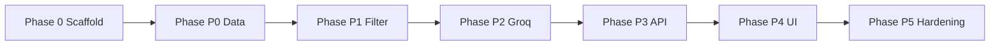

# Phase-Wise Implementation Plan

AI-powered restaurant recommendation system, derived from [context.md](./context.md) and [architecture.md](./architecture.md). The repo is greenfield (docs only), so the plan includes **Phase 0 (scaffolding)** before the architecture’s P0–P5.

---

## Overview

| Phase | Name | Outcome |
|-------|------|---------|
| **0** | Project scaffolding | Runnable Python project, config, layout |
| **P0** | Data ingestion | HF dataset loaded, normalized, indexed |
| **P1** | Filter service | Deterministic candidates from preferences |
| **P2** | LLM engine (Groq) | Rank, explain, parse, merge, fallback |
| **P3** | API layer | REST endpoints + orchestration |
| **P4** | UI | Preference form + result cards |
| **P5** | Hardening | Tests, logging, cache, degraded mode |



---

## Phase 0 — Project scaffolding

**Goal:** Establish the repository structure and tooling so later phases plug in cleanly.

### Tasks

1. Create layout per architecture §16:
   - `src/data/`, `src/services/`, `src/llm/`, `src/api/`, `src/ui/`
   - `tests/fixtures/`, `data/` (gitignored cache)
2. Add `requirements.txt`: `datasets`, `pandas`, `pydantic`, `python-dotenv`, `fastapi`, `uvicorn`, `httpx` (Groq HTTP; no OpenAI SDK required), `pytest`
3. Add `.env.example` with: `HF_DATASET_NAME`, `LLM_PROVIDER` (default `groq`), `LLM_API_KEY` (Groq key), `LLM_MODEL` (e.g. `llama-3.3-70b-versatile`), `MAX_CANDIDATES`, `DEFAULT_TOP_K`, `DATA_CACHE_PATH`
4. Add `README.md` with setup, env vars, and how to run each entry point
5. Define Pydantic settings module for configuration (§10)

### Deliverables

- Installable venv and `pip install -r requirements.txt` succeeds
- Empty package structure with `__init__.py` where needed

### Acceptance criteria

- [ ] `python -c "import src"` works from project root
- [ ] `.env.example` documents all required variables
- [ ] `data/` is in `.gitignore`

### Requirements covered

- Infrastructure only (enables all checklist items in context.md)

---

## Phase P0 — Data ingestion and index

**Goal:** Load [ManikaSaini/zomato-restaurant-recommendation](https://huggingface.co/datasets/ManikaSaini/zomato-restaurant-recommendation), normalize to the canonical model, derive `cost_band`, build queryable index.

**Depends on:** Phase 0

### Tasks

| # | Task | Module / file |
|---|------|----------------|
| 1 | Implement `load_dataset()` via `datasets` or Parquet cache | `src/data/ingestion.py` |
| 2 | Map HF columns → `Restaurant` model (discover columns at first run) | `src/data/models.py` |
| 3 | Preprocess: trim location, split display_location by comma (extract first segment for clean UI dropdowns), split cuisines, clamp ratings, drop invalid rows, and recursively convert numpy `ndarray` objects to Python lists for JSON serialization | `ingestion.py` |
| 4 | Derive `cost_band` from cost percentiles (33rd / 66th) | `ingestion.py` |
| 5 | Optional Parquet cache + revision hash for idempotent reload | `ingestion.py` |
| 6 | Build in-memory indexes by `location`, `cuisine`, `cost_band` | `src/data/index.py` |
| 7 | Export `RestaurantIndex` singleton loaded at startup | `index.py` |

### Domain models (`src/data/models.py`)

```text
Restaurant, UserPreferences, RecommendationResult, RecommendationResponse
```

(as in architecture §4.2)

### Deliverables

- CLI or script: `python -m src.data.ingestion` prints row count, sample record, band distribution
- `RestaurantIndex` with `get_all()`, `by_location()`, etc.

### Acceptance criteria

- [ ] Dataset loads from Hugging Face (or local cache on retry)
- [ ] ≥90% of rows have `name`, `location`, `rating`, `cost`
- [ ] `cost_band` populated for all retained rows
- [ ] Indexes return candidates for a known city in <100 ms (in-memory)
- [ ] Logs: dropped row count, schema mismatches

### Tests (start here)

- `tests/test_ingestion.py`: fixture CSV/Parquet subset — schema mapping, null handling, `cost_band` bands

### Requirements covered

| Context checklist | Status after P0 |
|-------------------|-----------------|
| Load and preprocess Zomato dataset from Hugging Face | Done |

---

## Phase P1 — User preferences and filter service

**Goal:** Validate preferences and return a capped, ordered candidate list using deterministic filters with relaxation.

**Depends on:** P0

### Tasks

| # | Task | Details |
|---|------|---------|
| 1 | `UserPreferences` validation | location required; budget enum; min_rating 0–5; cuisine string |
| 2 | Budget → cost_band mapping at filter time | match user `budget` to restaurant `cost_band` |
| 3 | `FilterService.filter(prefs, index)` | order: location → min_rating → cuisine → budget (§7.1) |
| 4 | Relaxation if count < 5 | −0.5 rating, partial cuisine, adjacent budget band |
| 5 | Cap candidates (`MAX_CANDIDATES`, default 30) | sort pre-LLM by rating or cost proximity |
| 6 | Optional keyword scan on `additional_preferences` | if metadata tags exist |

### Deliverables

- `src/services/filter.py` with `filter(preferences) -> list[Restaurant]`
- Internal API: `recommend_filter_only(prefs) -> list[Restaurant]` for degraded mode later

### Acceptance criteria

- [ ] Strict filters return only matching restaurants
- [ ] Empty strict set triggers relaxation and logs which rules relaxed
- [ ] Candidate list length ≤ `MAX_CANDIDATES`
- [ ] Unknown location returns empty list + message (no crash)

### Tests

- `tests/test_filter.py`: location/cuisine/budget/rating combos; relaxation paths; cap behavior

### Requirements covered

| Context checklist | Status after P1 |
|-------------------|-----------------|
| Accept user preferences | Models + validation |
| Filter restaurant data based on user input | Done |

---

## Phase P2 — LLM integration and recommendation orchestrator

**Goal:** Prompt builder, **Groq** client, JSON parse, merge with candidates, degraded fallback.

**Depends on:** P1

**LLM provider: Groq only (not OpenAI).** Use [Groq](https://groq.com/) at `https://api.groq.com/openai/v1` with `httpx` — same JSON shape as chat completions, but credentials and models are Groq’s. Do not set `LLM_PROVIDER=openai` or OpenAI model names (e.g. `gpt-4o-mini`).

| Variable | Example |
|----------|---------|
| `LLM_PROVIDER` | `groq` |
| `LLM_API_KEY` | Groq API key from [console.groq.com](https://console.groq.com/) |
| `LLM_MODEL` | `llama-3.3-70b-versatile` |

### Tasks

| # | Task | Module |
|---|------|--------|
| 1 | `LLMClient` interface + **`GroqClient`** (Groq API via `httpx`; not OpenAI) | `src/llm/client.py` |
| 2 | JSON schemas for prompt payload and LLM response | `src/llm/schemas.py` |
| 3 | `PromptBuilder.build(candidates, preferences)` | system + user JSON (§6.2) |
| 4 | `RecommendationOrchestrator.recommend()` | filter → prompt → **Groq** → parse → merge |
| 5 | Guardrails: only candidate IDs; drop unknown IDs; retry once on bad JSON | `recommender.py` |
| 6 | **Degraded mode:** LLM fail → top-K from filter, `degraded_mode=true`, no explanations | `recommender.py` |
| 7 | `health_check()` on Groq client | `client.py` |

### Deliverables

- `src/llm/client.py` — `GroqClient` with `complete()` and `health_check()`
- `src/services/prompt_builder.py`
- `src/services/recommender.py` exposing `recommend(preferences, top_k=5) -> RecommendationResponse`

### Acceptance criteria

- [ ] Live **Groq** call returns 5 ranked items with explanations (manual smoke test with valid `LLM_API_KEY`)
- [ ] Factual fields (`name`, `rating`, `cost`) always from dataset after merge
- [ ] Invalid JSON → one retry → degraded mode
- [ ] No hallucinated restaurant IDs in final response
- [ ] Optional `summary` field populated when requested

### Tests

- Mock `LLMClient` / `GroqClient` with valid/malformed JSON fixtures (no live OpenAI or Groq in CI)
- Snapshot test for prompt shape (no live API in CI)

### Requirements covered

| Context checklist | Status after P2 |
|-------------------|-----------------|
| Build LLM prompt with structured filtered data | Done |
| Use LLM to rank restaurants and generate explanations | Done |

---

## Phase P3 — Application / API layer

**Goal:** HTTP API that orchestrates the full pipeline; metadata for UI dropdowns.

**Depends on:** P2

### Tasks

| Endpoint | Behavior |
|----------|----------|
| `GET /health` | App up, dataset loaded, optional LLM health |
| `POST /recommend` | Body per §8.2; returns `RecommendationResponse` |
| `GET /metadata/locations` | Distinct locations from index |
| `GET /metadata/cuisines` | Distinct cuisines from index |

Implementation: `src/api/routes.py` + FastAPI app factory; load index on startup.

### Deliverables

- Runnable: `uvicorn src.api.main:app --reload`
- Request validation via Pydantic models matching §8.2

### Acceptance criteria

- [ ] `POST /recommend` returns full response schema including `meta.candidates_considered`, `filters_applied`
- [ ] Zero candidates → 200 with empty list + helpful message
- [ ] Input sanitization (length limits on `additional_preferences`)
- [ ] Latency: filter stage <100 ms (local index)

### Tests

- `tests/test_api.py`: contract tests with TestClient + mocked LLM

### Requirements covered

- End-to-end backend ready for UI (all context workflow steps except display)

---

## Phase P4 — Presentation layer (UI)

**Goal:** User-facing form and results aligned with context.md output fields.

**Depends on:** P3 (or direct `recommend()` for Streamlit-only)

### Recommended approach

**Streamlit** (`src/ui/app.py`) for fastest demo; calls FastAPI or imports `recommend()` directly.

### UX tasks (§9.2)

1. Form: location (autocomplete from `/metadata/locations`), budget dropdown, cuisine, min rating slider, optional additional preferences textarea
2. Submit → loading spinner (LLM 2–8 s)
3. Show `summary` above list when present
4. Card per result: name, cuisine, rating, estimated cost, AI explanation, rank
5. Banner when `degraded_mode` is true

### Deliverables

- `streamlit run src/ui/app.py`
- README section: “Run the app”

### Acceptance criteria

- [ ] User can complete full flow without touching API manually
- [ ] All five required display fields visible per context.md
- [ ] Loading state visible during LLM call
- [ ] Invalid form inputs show validation errors

### Requirements covered

| Context checklist | Status after P4 |
|-------------------|-----------------|
| Display results: name, cuisine, rating, cost, AI explanation | Done |

**MVP complete** after P4.

---

## Phase P5 — Hardening, testing, and operations

**Goal:** Production-quality reliability, observability, and CI-friendly tests.

**Depends on:** P4

### Tasks

| Area | Work |
|------|------|
| **Testing** | Full pytest suite; HF fixture subset in `tests/fixtures/` (no HF in CI) |
| **Logging** | Structured logs: request id, filter counts, LLM latency, token usage, parse errors |
| **Resilience** | Dataset download retry + backoff; LLM timeout retry (§11) |
| **Caching** | Optional Parquet data cache; optional response cache by preference hash |
| **Performance** | Tune `MAX_CANDIDATES`; dev vs prod model via env |
| **Security** | Never commit `.env`; rate-limit note for public deploy |
| **Deployment** | Dockerfile optional; document Render/Railway env injection |

### Deliverables

- `pytest` passes in CI
- `.env.example` complete; README documents degraded mode and costs
- Optional Docker compose: API + Streamlit

### Acceptance criteria

- [ ] CI runs tests without network (fixtures only)
- [ ] Degraded mode covered by integration test
- [ ] README documents failure behaviors from §11

---

## Requirements traceability (full checklist)

| # | Requirement (context.md) | Phase |
|---|--------------------------|-------|
| 1 | Load and preprocess HF dataset | P0 |
| 2 | Accept user preferences | P1 (models), P4 (form) |
| 3 | Filter by user input | P1 |
| 4 | Build LLM prompt | P2 |
| 5 | LLM rank + explain | P2 |
| 6 | Display name, cuisine, rating, cost, explanation | P4 |

---

## Suggested timeline (indicative)

| Phase | Effort (solo dev) |
|-------|-------------------|
| 0 | 0.5 day |
| P0 | 1–2 days |
| P1 | 1 day |
| P2 | 1–2 days |
| P3 | 0.5–1 day |
| P4 | 1 day |
| P5 | 1–2 days |
| **Total MVP (through P4)** | **~5–7 days** |
| **With hardening** | **~7–9 days** |

---

## Phase exit checklist (definition of done)

Before moving to the next phase:

1. **Acceptance criteria** for that phase are met
2. **Unit tests** for new logic are green
3. **Manual smoke test** documented in README or phase notes
4. **No secrets** in repo; config via `.env` only

---

## Critical path and parallelization

**Critical path:** P0 → P1 → P2 → P3 → P4

**Can parallelize after P1:**

- P2 prompt builder (mock client) while finishing filter edge cases
- P4 UI mockups with static JSON while P3 API is in progress

**Do not skip:** P0 data quality — bad schema mapping breaks filter, LLM, and UI.

---

## Technology stack (per architecture Appendix B)

| Layer | Choice |
|-------|--------|
| Language | Python 3.10+ |
| Data | `datasets`, `pandas` |
| API | FastAPI + Uvicorn |
| UI | Streamlit (demo) or React later |
| LLM | **Groq** only (default `llama-3.3-70b-versatile`; not OpenAI) |
| Config | `python-dotenv`, Pydantic |
| Testing | pytest |

---

## Next step

Start with **Phase 0 + P0**: scaffold the repo, load the Hugging Face dataset once, inspect real column names, then lock `Restaurant` field mapping before building filters.

---

## Related documents

- [context.md](./context.md) — Project overview and workflow summary
- [architecture.md](./architecture.md) — Technical architecture and component design
- [prblmstatement.txt](./prblmstatement.txt) — Original problem statement
